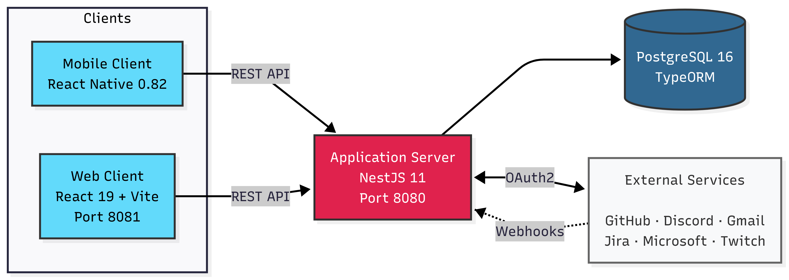
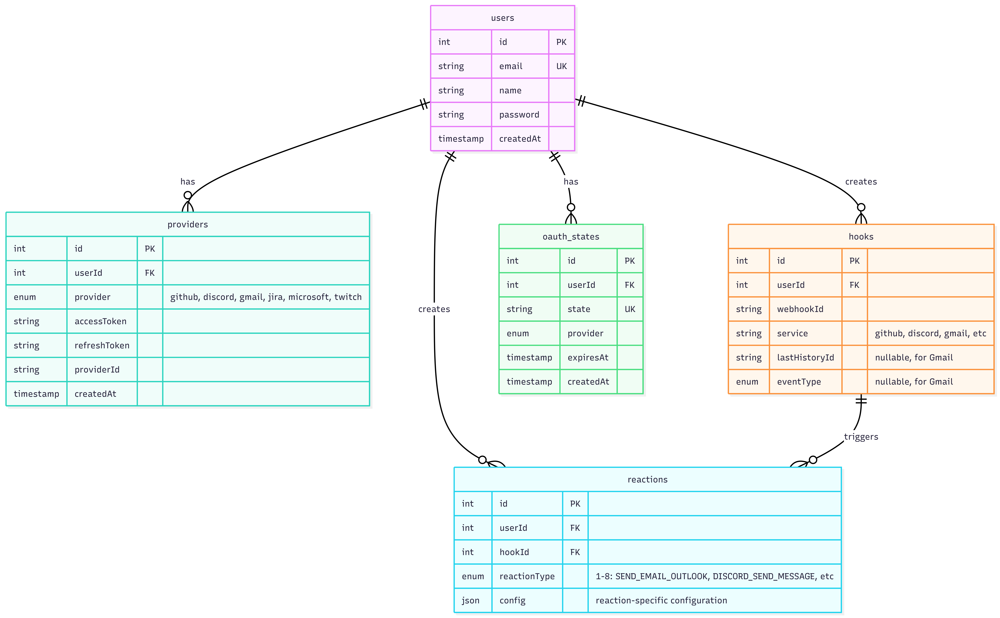
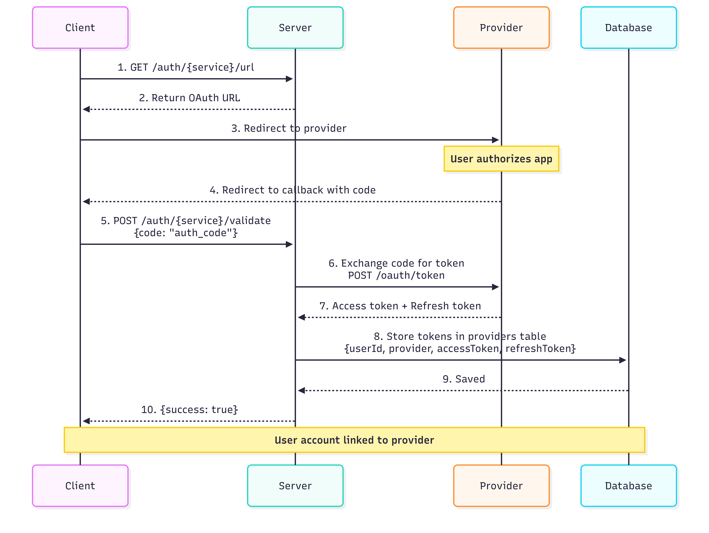
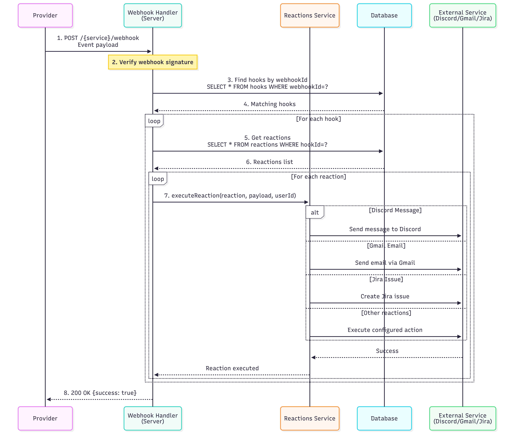

# Architecture

## Overview

AREA follows a client-server architecture with strict separation of concerns.



## Components

### Application Server

**Technology:** NestJS 11 + TypeScript

**Port:** 8080

**Responsibilities:**
- Business logic
- REST API
- Authentication (JWT + OAuth2)
- Service integrations (GitHub, Discord, Gmail, etc.)
- Webhook management
- Database operations

### Web Client

**Technology:** React 19 + Vite

**Port:** 8081

**Responsibilities:**
- User interface
- HTTP requests to server
- OAuth redirects

**Stateless:** No business logic.

### Mobile Client

**Technology:** React Native 0.82

**Platform:** Android

**Responsibilities:**
- Native mobile UI
- API communication
- OAuth handling

**APK Distribution:** Served by web client at `/client.apk`

### Database

**Technology:** PostgreSQL 16

**ORM:** TypeORM



## Authentication Flow



## Webhook Flow



## Data Flow Example: GitHub to Discord

**Setup:**
1. User creates webhook for GitHub repository
   - `POST /github/create-webhook` with repo details
   - Server registers webhook with GitHub API
   - Webhook stored in database

2. User creates reaction for that webhook
   - `POST /reactions` with Discord configuration
   - Reaction linked to webhook in database

**Execution:**
3. Code is pushed to GitHub repository
   - GitHub calls `POST /github/webhook` with event data
   - Server receives and verifies webhook

4. Server processes webhook
   - Finds webhook by `webhookId`
   - Retrieves associated reactions
   - Executes Discord reaction
   - Sends message to Discord via API

## Security

- **JWT tokens** for authentication
- **OAuth2** for third-party services
- **Encrypted token storage** in database
- **Webhook signature verification** for all providers
- **CORS protection**
- **Environment variables** for secrets
- **Password hashing** with bcrypt

## Deployment

**Docker Compose** manages all services:

```yaml
services:
  postgres:      # Database
  server:        # NestJS API
  client_web:    # React frontend
  client_mobile: # React Native build
```

**Volumes:**
- `postgres_data` - Database persistence
- `shared-client-volume` - APK sharing between mobile and web clients

## API Design

**REST principles:**
- Resource-based URLs
- HTTP methods (GET, POST, PUT, DELETE)
- JSON payloads
- Standard HTTP status codes

**Swagger documentation:** Auto-generated from NestJS decorators at `/api-docs`
